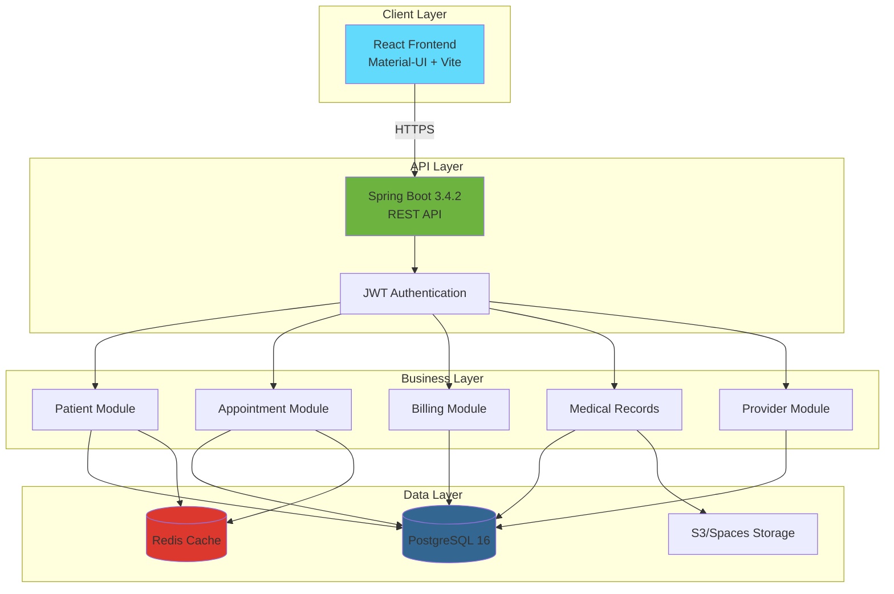

# Healthcare Platform

> Modern, HIPAA-compliant healthcare management system built with Spring Boot and React

[](https://www.oracle.com/java/)
[](https://spring.io/projects/spring-boot)
[](https://reactjs.org/)
[](https://www.typescriptlang.org/)
[]()

## Overview

Healthcare Platform is a comprehensive healthcare management system designed for modern medical practices. It provides end-to-end solutions for patient management, appointment scheduling, electronic medical records, billing, and compliance tracking.

### Key Features

- 👥 **Patient Management** - Complete patient demographics, medical history, and insurance tracking
- **Appointment Scheduling** - Smart scheduling with availability checking and automated reminders
- **Provider Management** - Healthcare provider profiles, specializations, and schedules
- **Electronic Medical Records (EMR)** - HIPAA-compliant medical records with document management
- **Billing & Invoicing** - Automated invoice generation, payment tracking, and insurance claims
- **Notifications** - Multi-channel notifications (email, SMS, in-app)
- **Security** - JWT authentication, role-based access control, audit logging
- **Dashboard** - Real-time analytics and reporting
- **Location Management** - Multi-facility support with departments and rooms
- **HIPAA Compliance** - Comprehensive audit trails and PHI access logging
## Demo

🎥 **Video Demo:**


## Tech Stack

### Backend
- **Framework:** Spring Boot 3.4.2
- **Language:** Java 21
- **Build Tool:** Maven 3.9+
- **Database:** PostgreSQL 16
- **Cache:** Redis 7
- **ORM:** Spring Data JPA + Hibernate
- **Migrations:** Flyway
- **Security:** Spring Security + JWT
- **API Docs:** Swagger/OpenAPI

### Frontend
- **Framework:** React 18
- **Language:** TypeScript 5
- **Build Tool:** Vite 7.3
- **UI Library:** Material-UI v6
- **State Management:** Zustand
- **Data Fetching:** React Query (TanStack Query)
- **Routing:** React Router v7
- **Forms:** React Hook Form + Zod

### Infrastructure
- **Containerization:** Docker & Docker Compose
- **Cloud:** DigitalOcean App Platform / Droplets
- **Storage:** DigitalOcean Spaces (S3-compatible)
- **CI/CD:** GitHub Actions
- **Monitoring:** Spring Boot Actuator

## Quick Start

### Prerequisites

- Java 21 (Eclipse Temurin recommended)
- Node.js 20+ and npm
- Docker & Docker Compose
- PostgreSQL 16 (or use Docker)
- Redis 7 (or use Docker)

### 1. Clone Repository

```bash
git clone https://github.com/blanho/healthcare-platform.git
cd healthcare-platform
```

### 2. Start Local Services

```bash
docker compose -f deploy/docker-compose.yml up -d
```

This starts PostgreSQL, Redis, pgAdmin, MailHog, MinIO, and LocalStack.

### 3. Start Backend

```bash
cd src
./mvnw spring-boot:run -pl healthcare-app
```

Backend runs on `http://localhost:8080`

### 4. Start Frontend

```bash
cd web
npm install
npm run dev
```

Frontend runs on `http://localhost:5173`

### 5. Access Application

- **Frontend:** http://localhost:5173
- **Backend API:** http://localhost:8080
- **API Docs:** http://localhost:8080/swagger-ui.html
- **Health Check:** http://localhost:8080/actuator/health
- **pgAdmin:** http://localhost:5050 (admin@healthcare.com / admin)
- **MailHog:** http://localhost:8025
- **MinIO:** http://localhost:9001 (minioadmin / minioadmin)

## Documentation

📚 Comprehensive documentation available in the [docs/](docs/) folder:

- **[Development Guide](docs/DEVELOPMENT.md)** - Local setup, debugging, testing
- **[Architecture](docs/ARCHITECTURE.md)** - System design, data flow, diagrams
- **[API Documentation](docs/API.md)** - REST API endpoints and examples
- **[Backend Modules](docs/MODULES.md)** - Detailed module breakdown
- **[Deployment Guide](DEPLOYMENT.md)** - DigitalOcean deployment instructions

## Project Structure

```
healthcare-platform/
├── src/                           # Backend (Spring Boot)
│   ├── healthcare-app/            # Main application
│   ├── healthcare-common/         # Shared utilities
│   ├── healthcare-patient/        # Patient module
│   ├── healthcare-appointment/    # Appointment module
│   ├── healthcare-provider/       # Provider module
│   ├── healthcare-billing/        # Billing module
│   ├── healthcare-medical-record/ # Medical records module
│   ├── healthcare-notification/   # Notification module
│   ├── healthcare-audit/          # Audit logging module
│   ├── healthcare-auth/           # Authentication module
│   ├── healthcare-location/       # Location module
│   └── pom.xml                    # Parent POM
│
├── web/                           # Frontend (React)
│   ├── src/
│   │   ├── components/            # Reusable UI components
│   │   ├── features/              # Feature modules
│   │   ├── pages/                 # Page components
│   │   ├── hooks/                 # Custom React hooks
│   │   ├── stores/                # Zustand stores
│   │   ├── lib/                   # API clients & utilities
│   │   └── types/                 # TypeScript types
│   ├── package.json
│   └── vite.config.ts
│
├── deploy/                        # Deployment configs
│   ├── docker-compose.yml         # Local development
│   └── docker-compose.prod.yml    # Production
│
├── docs/                          # Documentation
├── scripts/                       # Utility scripts
└── .github/                       # GitHub configs & workflows
```

## Architecture

High-level system overview:



📊 **[View detailed diagrams →](docs/DIAGRAMS.md)** (ER diagrams, sequence diagrams, workflows)

## Development

### Backend Development

```bash
# Compile
./mvnw clean compile

# Run tests
./mvnw test

# Run specific module tests
./mvnw test -pl healthcare-patient

# Code coverage
./mvnw test jacoco:report

# Package
./mvnw package -DskipTests

# Run with specific profile
./mvnw spring-boot:run -Dspring-boot.run.profiles=local
```

### Frontend Development

```bash
# Install dependencies
npm install

# Start dev server
npm run dev

# Build for production
npm run build

# Preview production build
npm run preview

# Run tests
npm test

# Type checking
npm run type-check

# Linting
npm run lint
npm run lint:fix

# Format code
npm run format
```

### Database Migrations

Flyway migrations are located in `src/healthcare-app/src/main/resources/db/migration/`

```bash
# Run migrations
./mvnw flyway:migrate

# Check migration status
./mvnw flyway:info

# Validate migrations
./mvnw flyway:validate
```

### Code Quality

```bash
# Backend
./mvnw checkstyle:check
./mvnw spotbugs:check
./mvnw pmd:check

# Frontend
npm run lint
npm run type-check
npm test
```

## Testing

### Backend Tests

```bash
# Unit tests
./mvnw test

# Integration tests
./mvnw verify -P integration-tests

# Coverage report
./mvnw jacoco:report
open target/site/jacoco/index.html
```

### Frontend Tests

```bash
# Unit tests
npm test

# Coverage
npm run test:coverage
```

## Deployment

### Development Environment

```bash
docker compose -f deploy/docker-compose.yml up -d
```

### Production (DigitalOcean)

See [DEPLOYMENT.md](DEPLOYMENT.md) for complete deployment guide.

**Quick Deploy:**

```bash
# Create .env file
cp .env.example .env
# Edit .env with production values

# Deploy with Docker Compose
docker compose -f deploy/docker-compose.prod.yml up -d
```

### Environment Variables

```bash
# Database
DATABASE_URL=jdbc:postgresql://host:5432/healthcare
DATABASE_USERNAME=healthcare
DATABASE_PASSWORD=your-password

# Redis
REDIS_HOST=localhost
REDIS_PORT=6379

# JWT
JWT_SECRET=your-secret-key
JWT_EXPIRATION=3600000

# AWS/Spaces
AWS_ACCESS_KEY_ID=your-key
AWS_SECRET_ACCESS_KEY=your-secret
S3_BUCKET_NAME=healthcare-documents

# See .env.example for complete list
```

## API Examples

### Authentication

```bash
# Login
curl -X POST http://localhost:8080/api/auth/login \
  -H "Content-Type: application/json" \
  -d '{"username":"admin","password":"admin123"}'

# Response
{
  "token": "eyJhbGciOiJIUzI1NiIs...",
  "type": "Bearer",
  "expiresIn": 3600000
}
```

### Create Patient

```bash
curl -X POST http://localhost:8080/api/patients \
  -H "Authorization: Bearer <token>" \
  -H "Content-Type: application/json" \
  -d '{
    "firstName": "John",
    "lastName": "Doe",
    "dateOfBirth": "1980-05-15",
    "gender": "MALE",
    "email": "john.doe@email.com",
    "phone": "+1234567890"
  }'
```

See [API Documentation](docs/API.md) for complete API reference.

## Security

- **Authentication:** JWT-based with configurable expiration
- **Authorization:** Role-based access control (RBAC)
- **Password Hashing:** BCrypt with salt
- **HIPAA Compliance:** Comprehensive audit logging of all PHI access
- **Data Encryption:** PHI encrypted at rest
- **CORS:** Configurable cross-origin policies
- **Input Validation:** Bean Validation (JSR 380)
- **SQL Injection:** Prevented via JPA/Hibernate parameterized queries
- **XSS Protection:** Content Security Policy headers

### User Roles

- `ROLE_ADMIN` - System administrator
- `ROLE_DOCTOR` - Healthcare provider
- `ROLE_NURSE` - Nursing staff
- `ROLE_RECEPTIONIST` - Front desk
- `ROLE_BILLING` - Billing department
- `ROLE_PATIENT` - Patient portal access

## Monitoring

### Health Checks

```bash
# Overall health
curl http://localhost:8080/actuator/health

# Database health
curl http://localhost:8080/actuator/health/db

# Redis health
curl http://localhost:8080/actuator/health/redis
```

### Metrics

```bash
# All metrics
curl http://localhost:8080/actuator/metrics

# Specific metric
curl http://localhost:8080/actuator/metrics/jvm.memory.used
```

### Logs

```bash
# Backend logs
tail -f src/healthcare-app/logs/application.log

# Docker logs
docker compose logs -f backend
```

## Contributing

1. Create a feature branch: `git checkout -b feature/my-feature`
2. Make changes and commit: `git commit -am 'Add new feature'`
3. Push to branch: `git push origin feature/my-feature`
4. Create Pull Request

### Code Style

- **Backend:** Google Java Style Guide
- **Frontend:** Airbnb JavaScript/TypeScript Style Guide
- Use provided code formatters (Spotless for Java, Prettier for TypeScript)

### Commit Messages

Follow [Conventional Commits](https://www.conventionalcommits.org/):

```
feat: add patient search endpoint
fix: resolve N+1 query in appointments
docs: update API documentation
refactor: extract common validation logic
test: add integration tests for billing module
```

## License

Proprietary - All rights reserved

---

## Support

- **Documentation:** [docs/](docs/)
- **Issues:** [GitHub Issues](https://github.com/your-org/healthcare-platform/issues)
- **Email:** support@healthcare.com

## Roadmap

- [ ] Mobile applications (React Native)
- [ ] Real-time notifications (WebSocket)
- [ ] Video consultations (WebRTC)
- [ ] HL7 FHIR integration
- [ ] Multi-language support (i18n)
- [ ] Advanced analytics dashboard
- [ ] Telemedicine features
- [ ] Pharmacy integration
- [ ] Insurance verification API

---

**Built with ❤️ for healthcare professionals**
