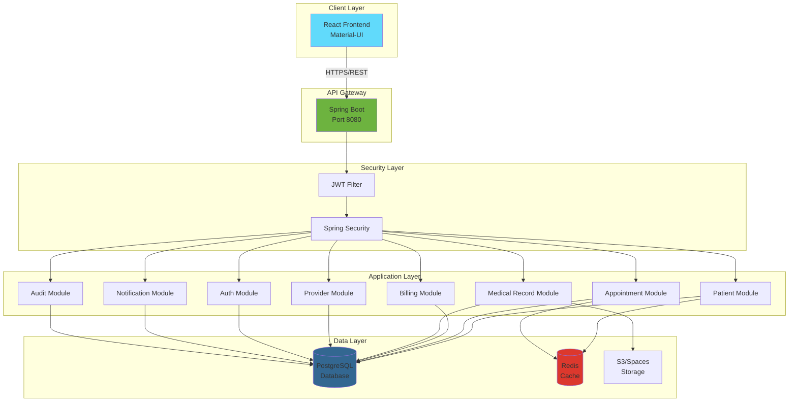
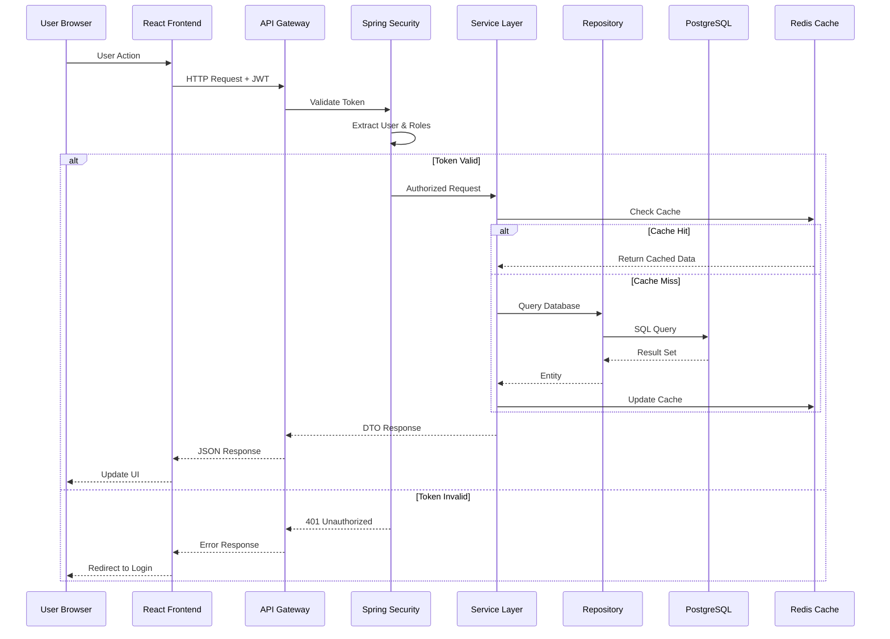
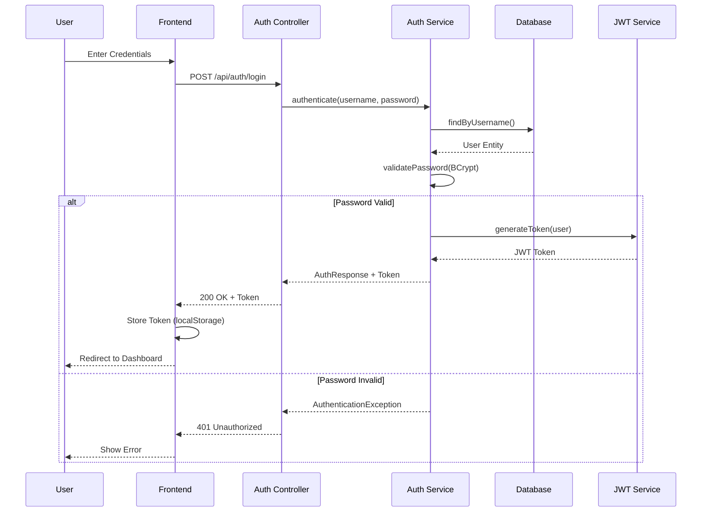
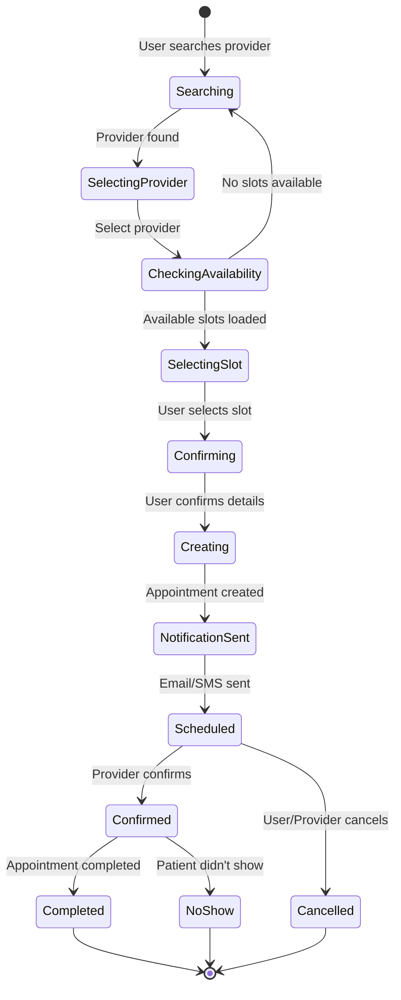
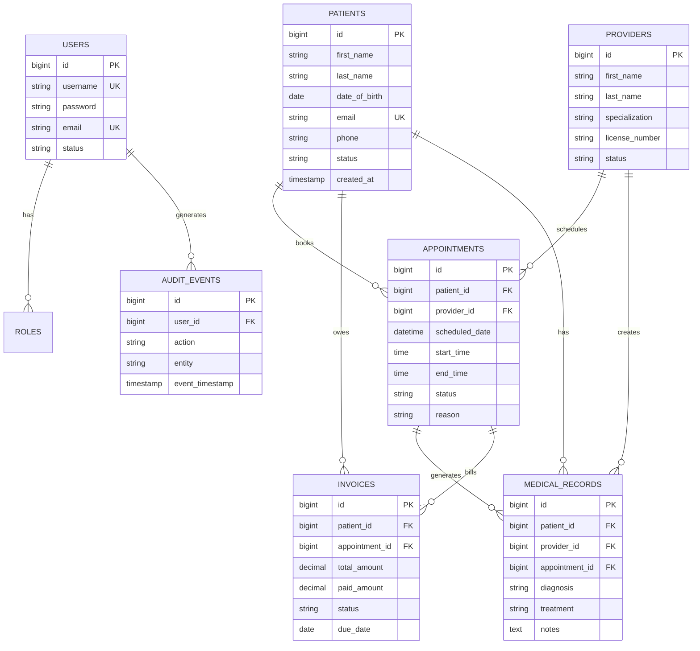
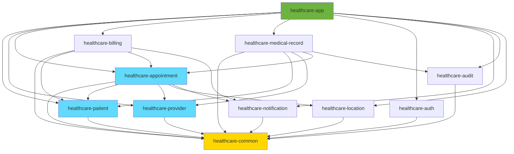
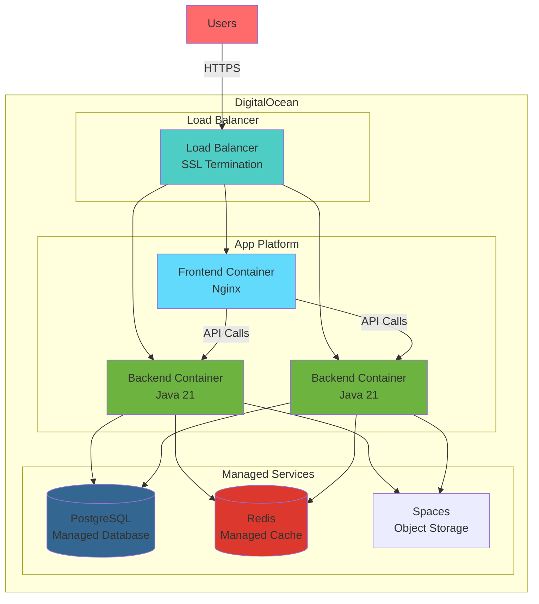
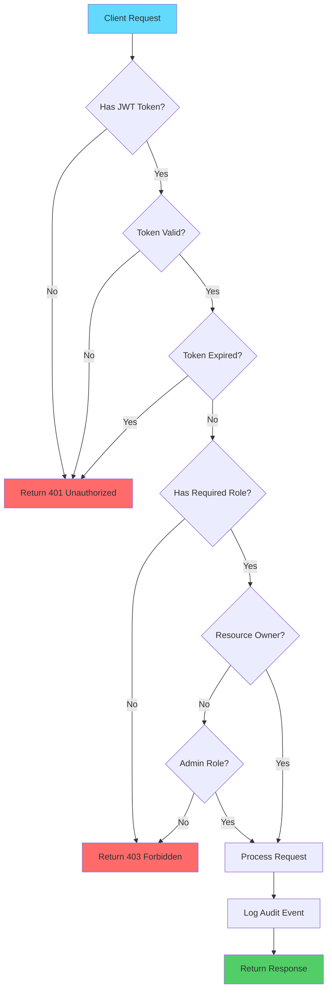

# Architecture Diagrams

This document contains various architecture and workflow diagrams for the Healthcare Platform.

## System Architecture

## Request Flow

## Authentication Flow

## Appointment Booking Workflow

## Data Model ER Diagram

## Module Dependencies

## Deployment Architecture

## Security Flow

---

## How to View These Diagrams

### GitHub
Mermaid diagrams render automatically on GitHub when viewing markdown files.

### VS Code
Install the "Markdown Preview Mermaid Support" extension to preview diagrams locally.

### Export as Images
Use tools like:
- [Mermaid Live Editor](https://mermaid.live) - Export as PNG/SVG
- [Draw.io](https://app.diagrams.net) - For custom diagrams
- [Excalidraw](https://excalidraw.com) - For hand-drawn style

## Creating Custom Diagrams

For more complex diagrams, use:
1. **Draw.io** - Desktop app or web version
2. **Lucidchart** - Professional diagramming
3. **Figma** - Design tool with diagram capabilities
4. **PlantUML** - Text-based UML diagrams

Save custom diagrams as images in `docs/images/` folder.
